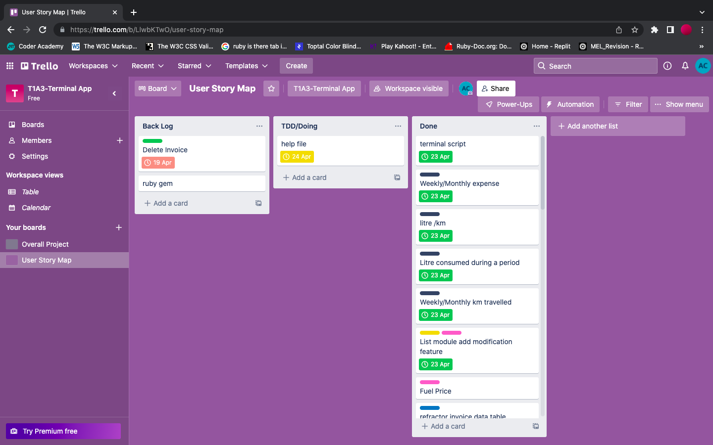

### Requirement 4 - Source control repository:
GitHub
https://github.com/anthonybchung/T1A3-Terminal-Application

Trello:

### Requirement 5 - Code Style

Following the style guide on the following website and Rubocop for code styling and styling convention.

- https://clearwater.readthedocs.io/en/stable/Clearwater_Ruby_Coding_Guidelines.html

### Requirement 6 - Proposal

The following were sent for proposal:

||
-

Figure 6.1 : Attachment sent to educator.

### Requirement 7 - Implementation Plan.

### Iteration Zero
#### Stories (Features)
Initial idea or features of the application.
||
-
Figure 7.1 User Story Mapping

The target time taken for each user story (ie green card) will be **half hour(30 mins)**. From creating a test, to building the code and refractoring.

#### Test Driven Development

||
-
Figure 7.2 Test Driven Development

Small Test were built then codes were written to build the foundation of the class. Thereafter, more small test were built on top of the previous test to write more code for the class. A table below(Figure 7.11) shows the different RSpec test were written for the project.

However, for a novice, this process was taking longer than expected thus the user story mapping was revised. The plan was to build a minimal value product (MVP).

||
-
Figure 7.3 on the wall

||
-
Figure 7.4 transfered to lucid chart

#### Flow Charts
##### Main Level

||
-
Figure 7.5 Main Level Flow Chart

The application will have a switch case when it accepts ARGV

- null : which will run the actual user's data
- demo : mock data are pre-installed into the application. The user will not be able to save data with demo mode.
- help : help documents for the user. TTY-markdown was used to compose the terminal base help.


The application is divided into 4 sections
  
  - New Invoice
  - Retrieve Invoice (will only display up if invoice file is not empty)
  - Analyse Data (will only display if invoice file is not empty)
  - Delete all invoices

If the user is in **demo** mode, the application will exit after the user choose to exit. However, if it is in **normal** mode, and when the user choose exit, the application will copy the data from the temp files to stored files (suffix "_actual")

###### New Invoice

||
-
Figure 7.6 Flow chart for New Invoice

The processes where the uer needs to type in the data have classes that will handle errors if the user does not enter the correct data in the correct format.
A **UserSelection** class was built to handle the user selection which will be used in the Data Input section (reused for fuel_type,fuel_brand, and location) and Retrieve Data section. It is also used for file input/output.
A class(**InvoiceInterface**) was built to handle the modification of the data in the User Input section and Unser Retrieve data of the application.

||
-
Figure 7.7 Input classes

Once the user confirms the data, it is written to the tempory file (invoice.json)

###### Retrieve Invoice

In this section a table listing all the invoices will be displayed. The user can choose an invoice for updating the data.
**UserSelection** class is reused to assist in updating the data.
Some tables that display data need to be used in several places of the application. Thus 3 view classes were built for reusability(see Fig 7.9).

||
-

Figure 7.8 Retrieve Invoices

||
-

Figure 7.9 Classes to view tables
###### Data Analysis
A view class will be used to list all the invoices.
The user then can pick which two invoices is needed to do the calculations for the required data.

||
-

Figure 7.10 Data Analysis Flow chart.

#### Test Driven Development using Rspec
Rspec was used in the development of this application.
The test were mainly used to exam the error handling of user input format.

|Rspec file|Used to build class|Purpose|
| :--- | :--- | :--- |
|fuel_quantity_spec.rb|FuelQuantity| user input error-handling |
|invoice_file_send_data|InvoiceFile|linking file to app|
|odometer_spec| Odometer | user input file error-handling |
| paid_spec | Paid | user input file error-handling |
| price_spec | Price | user input file error-handling |
| user_select_spec | UserSelection | linking files to user selection|
Figure 7.11 TDD

#### Bash Script
The script is **fueltracker.sh** in the src directory.
To run it type the following in the terminal

```
cd to src
for demo
./fueltracker.sh demo

for actual with no pre-installed data
./fueltracker.sh

for help
./fueltracker.sh help
```

#### Trello Board
||
-
Figure 7.12 Early on in the project

||
-
Figure 7.13 Towards the end of the project

||
-
Figure 7.14 Final Trello card move.

##### Reference

- Martin, R., 2020. Clean agile. Pearson Education Inc, pp.66-69.
- Francino, Y. The essential guide to user story creation for agile leaders. https://techbeacon.com/app-dev-testing/essential-guide-user-story-creation-agile-leaders
- Martin, R., 2014. Advanced TDD: The Transformation Priority Premise. https://vimeo.com/97516288

---
### Requirement 8 - Help Documentation

### App Description
This app is to track fuel expenses and usage.

The app was build with Ruby and tested on a mac-OS.

### Installation
- Download all files from src
- run bundle install to install all the required gems
- Make sure fueltracker.sh is executable. If not do the following on the terminal in src directory
  
```
bundle install

chmod +x fueltracker.sh
```

### Usage
There are three modes to run Fuel Tacker.
#### Help
```
  . fueltracker help
```
or
```
  . fueltracker.sh -h
```
or
```
  . fueltraacker.sh -help
```
This will bring up a help file on the terminal.

#### Demo
```
  . fueltracker demo
```
This will load fuel tracker with dummy data for the user to get a hang of the app.
The user can add invoices, modify data and look at the analysed data.
User will not be able to save data on demo mode.

### Actual running
```
  . fueltacker
```
This will run the actual app with no dummy data.

#### First Screen
```
Select an option (Press ↑/↓ arrow to move and Enter to select)
‣ Input New Invoice
  Retrieve List of Invoices
  Analyse Data
  Delete all invoice
  Exit
```
  The following will only appear with there are invoices store in the system.
```
  Retrieve List of Invoices
  Analyse Data
  Delete all invoice
```
#### Input New Invoice

- First Input: Date
```
  Enter invoice date (dd-mm-yyyy):
```
The format must be in day-months-year, or else the application will raise an error and ask the question again

  - Second Input: Odometer
```
  Enter odometer distance km(must be an integer):
```
Must be an integer or else the system will raise an error and ask the question again.

- Third Input: Paid price
```
  Enter Paid Price $(xx.xx):
```
The total amount the user has to pay for the fuel. It must be a valid currency format (e.g: $59.88 without the dollar sign)

- Forth Input: Fuel Price per Litre
```
  Enter Fuel price per Litre cent(xxx.x):
```
The fuel price is in cent as displayed at the petrol station. It must be in a valid format or else an error will be raised.

- Fifth Input: Fuel Quantity
```
  Enter Fuel Quantity Litre(xxx.xx)
```
Quantity is in Litre and accept inputs to 2 decimal places only. An error will be raised if number does not have 2 decimals

- Sixth Input A: Fuel Type
```
  Select fuel type  option (Press ↑/↓ arrow to move and   Enter to select)
  ‣ E-10
    UL-91
    LAF-91
    V-Power-100
    Add option
```
Will give a user a list of options. If the option is not available, the user can add a new option.

- Sixth Input B: Option
```
  Enter new fuel type 
```
User can add any text because each company will have their own product names.

- Seventh Input: Brand Name
```
  Select fuel brand  option (Press ↑/↓ arrow to move and Enter to select)
  ‣ AMPOL
    SHELL
    Mobil
    Add option
```
The method of input is the same as Fuel Type

- Eighth Input: Location
```
  Select location  option (Press ↑/↓ arrow to move and Enter to select)
  ‣ Kingsford
    Mascot
    Maroubra
    Alexandria
    Add option
```
The method of input is the same as Fuel Type

- Confirming data
```
  ┌───────────────┬──────────┐
  │Attribute      │Data      │
  ├───────────────┼──────────┤
  │Date           │12-12-2002│
  │Odometer(km)   │12443     │
  │Paid($)        │2132.22   │
  │Fuel Price($/L)│23.3      │
  │Fuel Qty(l)    │213.44    │
  │Fuel Type      │E-10      │
  │Fuel Brand     │AMPOL     │
  │Location       │Kingsford │
  └───────────────┴──────────┘
  Are all the above data correct? (Y/n) 
``` 
If the user is satisfied with their inputs, they can press y to continue back to the main menu. Otherwise, the application will take them to a list of options.

```
Select an option? 
  1) Date
  2) Odometer
  3) Paid
  4) Fuel Price
  5) Fuel Quantity
  6) Fuel Type
  Choose 1-9 [1]: 
(Press tab/right or left to reveal more choices)
```
From there the application will take the user back to the choosen input.
Option 9 is for cancelling the modification.

#### Retrieve List of Invoices

Will display a list of Invoices.
The user can choose which invoice they want to modify.
The process is the same as above, modifying the data after entering all the data.

#### Analyse Data
Will display a list of Invoices like above.

```
History of all the invoices

Do you want to analyse data? (Y/n) 
```

```
History of all the invoices

Do you want to analyse data? Yes
Enter the starting index [1-5]
1
Enter the ending index [2-6]

```
User will be able to choose the initial invoice index for analysis. Then the ending invoice index for analysis

After analysis, a table will list all the analysed data.
The user can either press any key to contiue or the application will return to main menu after 3 minutes.


#### Delete all invoice
This will allow the user to clear the invoice file.

#### Exit
exit the application

